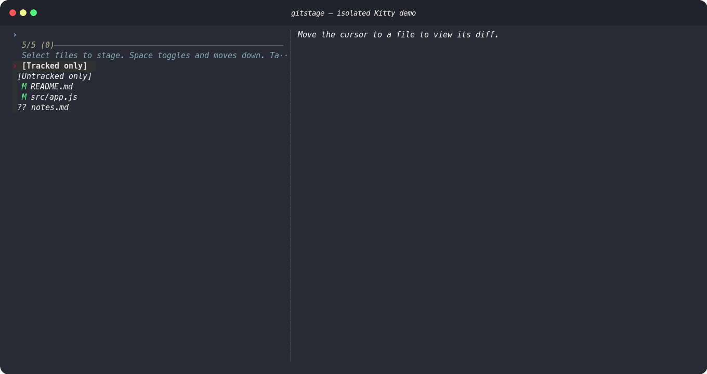
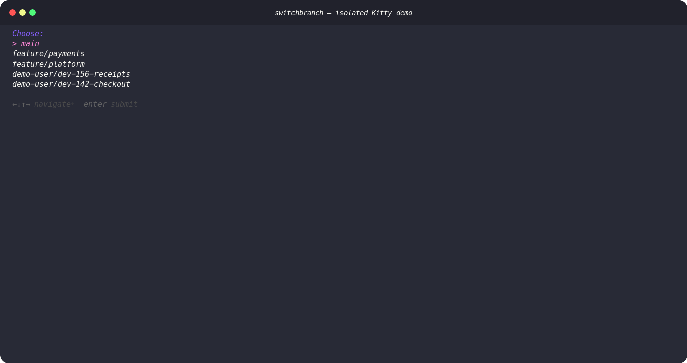
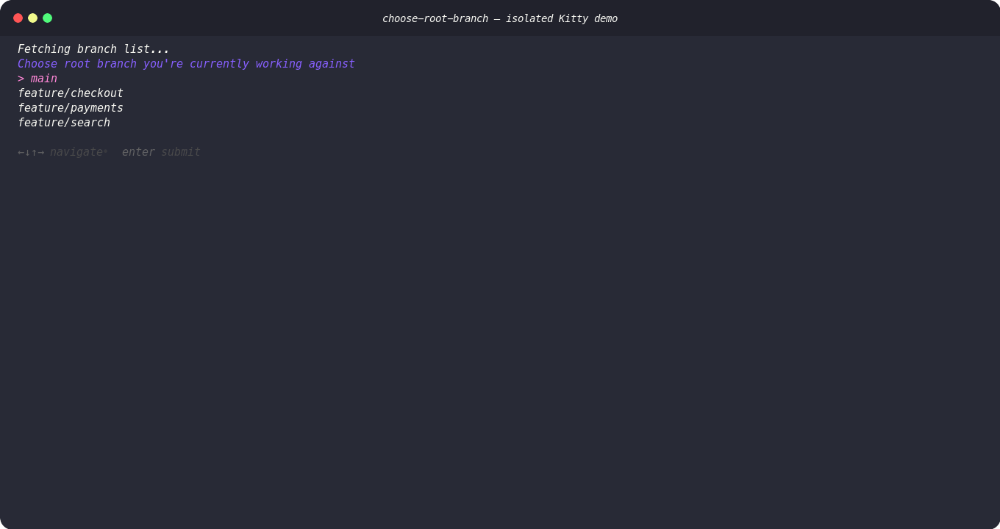
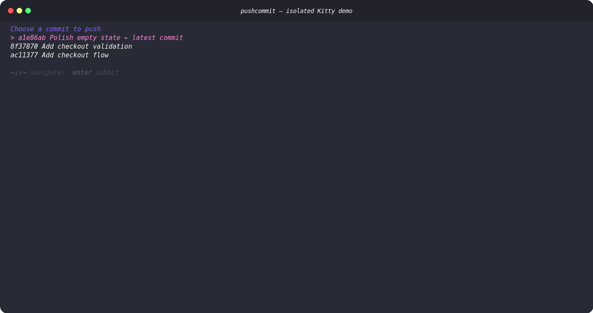

# rScripts

A small collection of focused command-line helpers for everyday Git workflows. Each command lives beside its own detailed README, while this page is the complete catalogue.

## Install

The interactive commands use [Charmbracelet Gum](https://github.com/charmbracelet/gum) or [fzf](https://github.com/junegunn/fzf). Install the dependencies you need, then symlink every command into `~/bin`:

```bash
brew install gum fzf diff-so-fancy
bash setup.sh
export PATH="$HOME/bin:$PATH"
```

`setup.sh` installs `choose-root-branch`, `gitstage`, `gojira`, `gol`, `install-githooks`, `pushcommit`, `rebasepro`, and `switchbranch`. Add the `PATH` export to your shell profile if `~/bin` is not already on your path.

## Commands

- [`gitstage`](#gitstage) — interactively stage changed and untracked files
- [`switchbranch`](#switchbranch) — switch among relevant local branches
- [`choose-root-branch`](#choose-root-branch) — select and remember a repository's base branch
- [`rebasepro`](#rebasepro) — fix up an earlier commit and autosquash it
- [`pushcommit`](#pushcommit) — push a selected commit to a selected branch
- [`gojira`](#gojira) — open the Jira issue named by a branch
- [`gol`](#gol) — open the Linear issue named by a branch
- [`install-githooks`](#install-githooks) — install the repository's shared Git hooks
- [`git_alias`](#git_alias) — optional Git aliases for ticket-based branch creation

## `gitstage`

Interactively stage unstaged tracked files and untracked files with `fzf`. The picker displays Git status symbols, supports bulk tracked/untracked actions, and shows a colorized diff through `diff-so-fancy`.

```bash
gitstage
```



Inside the picker:

- `Space` selects the highlighted entry and moves down.
- `Ctrl+A` selects every visible entry.
- `Tab` toggles the diff preview.
- `Enter` stages the selection.

The `[Tracked only]` and `[Untracked only]` rows make common bulk operations a single selection. Already staged-only files are omitted; files with both staged and unstaged changes remain available so their remaining edits can be staged.

Requirements: Git, `fzf`, an interactive terminal, and `diff-so-fancy` for previews. See [gitstage/README.md](gitstage/README.md) for the full behavior reference.

## `switchbranch`

Choose a branch to check out from a short, useful list: `main`, local `feature/*` branches, and your recently checked-out branches. Personal branches are identified from your normalized Git `user.name`.

```bash
switchbranch
```



Requirements: Git, `gum`, and a configured Git `user.name`. See [switchbranch/README.md](switchbranch/README.md).

## `choose-root-branch`

Select the remote branch that should act as the base for the current repository. The choice is stored as `ROOT_BRANCH` in a local `.rScripts` file and reused by `rebasepro` and `pushcommit`.

```bash
choose-root-branch
choose-root-branch --reset
```



The command considers `main` and remote `feature/*` branches, prints the selected branch to stdout for use by other scripts, and only prompts again when the setting is missing or `--reset` is passed.

Requirements: Git, an `origin` remote, and `gum`. See [choose-root-branch/README.md](choose-root-branch/README.md).

## `rebasepro`

Turn staged changes into a `fixup!` commit for one of your commits ahead of the selected root branch, then launch an interactive autosquash rebase.

```bash
rebasepro -- fixup
rebasepro -- fixup --reset
```

`fixup` is currently the only action. The command does nothing when there are no staged changes and refuses to start during an existing rebase. If unstaged changes remain after the fixup commit is created, it leaves the commit in place and skips the rebase so you can deal with the working tree first.

### Practical use case: put a review fix where it belongs

Suppose your branch has three intentionally separate commits:

```text
origin/main
  └─ Add checkout form
      └─ Add checkout validation
          └─ Add checkout analytics
```

A reviewer notices that the validation commit is missing an error message. Editing it in a new fourth commit would leave the history harder to read. Instead:

1. Add the error message and stage that change.
2. Run `rebasepro -- fixup`.
3. Select `Add checkout validation` as the target.
4. Review and save the interactive autosquash rebase.

The staged change is folded into the validation commit, while the form and analytics remain separate. Because autosquash rewrites the target commit and every descendant, use this on local work or coordinate before force-pushing a branch others already use.

Requirements: Git, `gum`, `choose-root-branch`, an `origin` remote, and at least one commit ahead of the root branch. See [rebasepro/README.md](rebasepro/README.md).

## `pushcommit`

Select one of your commits ahead of the root branch and push that exact commit to a target branch. The target can be selected from recently checked-out personal branches or supplied directly.

```bash
pushcommit
pushcommit --branch randolf/dev-123-short-description
```



If the remote branch does not exist, `pushcommit` creates it on `origin`. Pass `--reset` to reselect the root branch before choosing a commit.

### Practical use case: share the ready part of a branch

Suppose your local branch is three commits ahead of `origin/main`:

```text
origin/main
  └─ Add checkout flow
      └─ Add checkout validation    ← ready to share
          └─ Polish empty state     ← still in progress
```

QA needs the checkout flow and validation now, but the latest polish commit is not ready. Run `pushcommit`, select `Add checkout validation`, then choose a recent handoff branch or pass one explicitly:

```bash
pushcommit --branch randolf/dev-123-handoff
```

The remote handoff branch ends at the validation commit, so it contains the flow and validation commits but excludes the later empty-state work. `pushcommit` does not cherry-pick a lone commit: it makes the selected commit the target branch tip, including all of that commit's ancestors. An existing remote target must accept the update as a normal Git push.

Requirements: Git, `gum`, `choose-root-branch`, an `origin` remote, and a configured Git `user.name` when selecting a branch interactively. See [pushcommit/README.md](pushcommit/README.md).

## `gojira`

Open the Jira issue key embedded in the current branch name, such as `DSHARE-1234`.

```bash
gojira
gojira --interactive
gojira --copy
gojira --goto 1234
```

Options:

- `-i`, `--interactive` selects from personal local branches instead of using the current branch.
- `-c`, `--copy` copies the Jira URL rather than opening it.
- `-g`, `--goto NUMBER` opens `DSHARE-NUMBER` without inspecting a branch.

Requirements: macOS (`open` and `pbcopy`), Git, `gum`, and a configured Git `user.name`. The Jira site and `DSHARE` project are currently fixed in the script. See [gojira/README.md](gojira/README.md).

## `gol`

Open the Linear issue key embedded in the current branch name, such as `DEV-73`, using the Linear desktop app.

```bash
gol
gol --interactive
gol --copy
gol --goto DEV-73
gol --goto 73
```

Options:

- `-i`, `--interactive` selects from personal local branches instead of using the current branch.
- `-c`, `--copy` copies the `linear://` link rather than opening it.
- `-g`, `--goto ISSUE` accepts a full issue key or a number.

When `--goto` receives only a number, the prefix defaults to `DEV`. Override it with `GOL_DEFAULT_PREFIX`, for example `GOL_DEFAULT_PREFIX=DSH gol --goto 73`.

Requirements: macOS (`open` and `pbcopy`), Git, `gum`, a configured Git `user.name`, and the Linear desktop app. See [gol/README.md](gol/README.md).

## `install-githooks`

Symlink the hook scripts in [`githooks/`](githooks/) into the current repository's `.git/hooks` directory.

```bash
install-githooks
```

Existing hooks are preserved with numbered `.bak` suffixes. The included `prepare-commit-msg` hook prefixes ordinary commit messages with a `DSHARE-N` issue key found in the branch name; merge, squash, fixup, and already-prefixed messages are left alone.

Because the installed hooks are symlinks, later changes in rScripts take effect immediately. Repositories configured with `core.hooksPath` need manual setup. See [githooks/README.md](githooks/README.md).

## `git_alias`

An optional `.gitconfig` snippet that adds `git create-branch` and its shorter `git cb` alias. It extracts a ticket key from a Jira URL and combines it with your normalized Git `user.name` and an optional description.

```bash
git create-branch https://example.atlassian.net/browse/DEV-73 "short description"
# Creates: <normalized-user>/dev-73-short-description
```

Copy the `[alias]` entries from [`git_alias/git_alias`](git_alias/git_alias) into `~/.gitconfig`. This file is configuration, not an executable installed by `setup.sh`. See [git_alias/README.md](git_alias/README.md).

## Development

Run a syntax check on any changed executable before committing:

```bash
bash -n path/to/script
shellcheck path/to/script
```

After adding or renaming an entrypoint, update `setup.sh`, run it again, and verify the command through the `~/bin` symlink.
